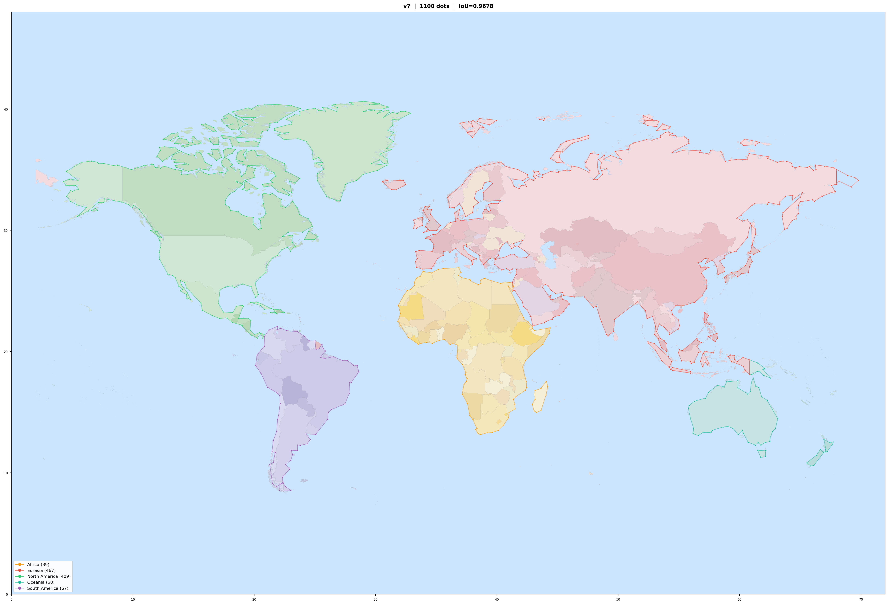
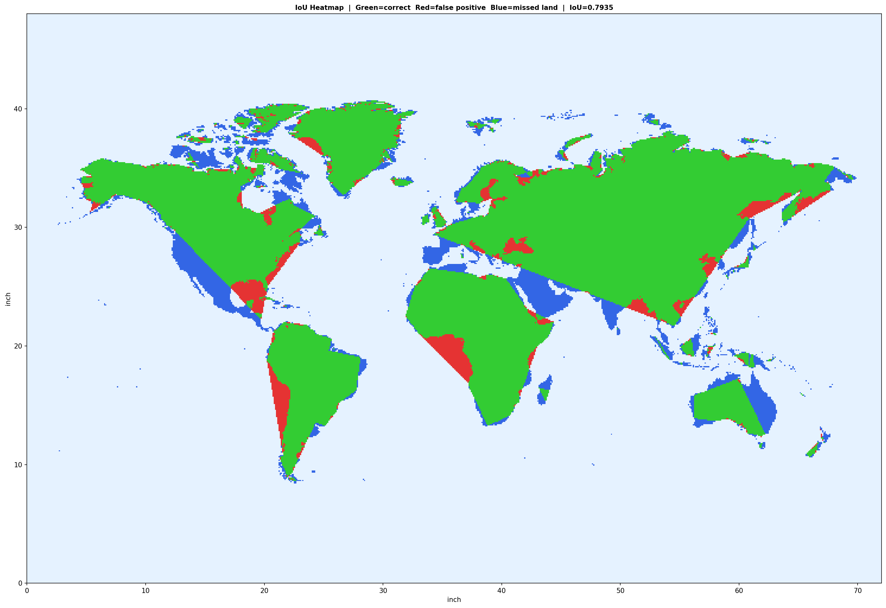
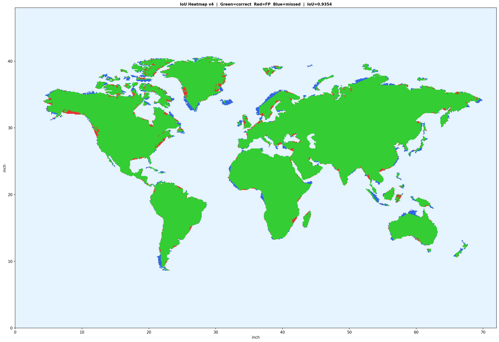
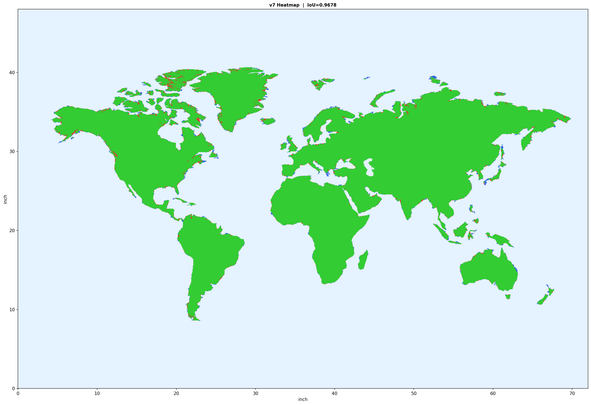

# World Map Pin Art

A world map made of pins and colored thread on a 72x48 inch wooden board. This project extracts continent outlines from GeoJSON data, optimizes pin placement using IoU-based algorithms, and generates projector-ready images for marking pin positions on the board.



## Pin Statistics

| Continent | Color | Pins | Outlines |
|-----------|-------|------|----------|
| Eurasia | Red `#e74c3c` | 467 | 25 |
| North America | Green `#2ecc71` | 409 | 20 |
| Africa | Orange `#f39c12` | 89 | 2 |
| Oceania | Teal `#1abc9c` | 68 | 5 |
| South America | Purple `#9b59b6` | 67 | 2 |
| **Total** | | **1100** | **54** |

## Algorithm Evolution & Results

The pin placement was iteratively optimized through 7 major algorithm versions, improving IoU (Intersection over Union between simplified polygon and actual land) from 79% to 96.78%.

### Version Comparison

| Version | Method | Dots | IoU | Key Insight |
|---------|--------|------|-----|-------------|
| v1 | Greedy removal (buggy cost) | 1189 | 79.35% | Cost function didn't distinguish inward/outward triangle direction |
| v2 | Direction-aware cost | 1189 | 82.44% | Fixed cost: `area * land_frac` (inside) vs `area * (1-land_frac)` (outside) |
| v3 | Douglas-Peucker + per-ring Greedy | 1189 | 92.64% | Two-stage: DP pre-simplify to 5x target, then IoU-greedy. Solved 238:1 compression ratio problem |
| v4 | DP + **Global** Greedy | 1100 | 93.54% | Single global heap across all polygons. Automatic budget allocation - no more per-ring quotas wasting points on small islands |
| v7-base | + Iterative error-region refinement | 1100 | 95.05% | Find large error regions, re-insert original coastline points, re-run greedy. Each round fixes the biggest remaining errors |
| v7-perturb | + Stochastic perturbation | 1100 | 95.98% | Random point moves along original coastline, accept if IoU improves. Hill climbing on point positions |
| v7-cycle | + Add/Perturb/Delete interleaved | 1100 | 96.18% | Three operations alternate in each cycle, creating synergy |
| v7-multi | + Multi-point moves (2-3 adjacent) | 1100 | 96.62% | Coordinated slide, normal push, differential - moves that single-point can't find |
| v7-7strat | + 7-strategy mixed (err-guide, bisect) | 1100 | 96.64% | Error-guided moves + edge bisection. Focused perturbation on high-error areas |
| **v7-final** | **+ Self-intersection fix + focused regions** | **1100** | **96.78%** | Fix polygon crossings, concentrated optimization on user-marked problem areas |
| v7-1200 | Same pipeline, 1200 dots | 1200 | 96.87% | +100 dots only gains +0.09% - diminishing returns confirmed |
| Spline | DP + Chaikin smooth + resample | 1211 | 93.70% | Smooth curves but loses sharp coastal features |
| Baseline | Adaptive curvature spacing | 1160 | 91.67% | Simple but effective baseline |

### IoU Heatmap Progression

Green = correct, Red = false positive (polygon covers ocean), Blue = missed land.

| v1 (79%) | v4 (93%) | v7-final (96.78%) |
|----------|----------|-------------------|
|  |  |  |

## Algorithm Details

### Final Pipeline (v7)

```
1. Load GeoJSON -> Merge countries per continent -> Extract polygons
2. Miller projection -> Panel coordinates (72x48 inch)
3. Rasterize land mask (20 PPI = 1440x960)
4. Douglas-Peucker pre-simplification (6x target)
5. Global IoU-Greedy removal to target dot count
6. Iterative optimization (30 cycles):
   a. ADD: Find error regions, insert original coastline points
   b. PERTURB: 7-strategy mixed perturbation (5000 iterations/cycle)
      - Single-point random slide along coastline
      - 2-3 point coordinated slide (same direction)
      - 2-3 point normal push (perpendicular to boundary)
      - 2-3 point differential (independent directions)
      - Error-guided move (toward nearest error region)
      - Edge bisection (split long edge + remove cheapest point)
      - Cross-ring transfer (budget rebalancing)
   c. DELETE: Global greedy trim back to target (lazy - only when needed)
7. Self-intersection detection & repair (Shapely buffer(0))
8. Focused optimization on user-marked problem areas
9. Checkpoint save for hot-reload
```

### Key Technical Decisions

- **Projection**: Miller Cylindrical (Mercator-like but 80% vertical stretch, reduces polar distortion)
- **Eurasia**: Europe + Asia merged as single continent (avoids Russia splitting issue)
- **Antimeridian**: Russia's Chukotka shifted to +360 longitude (prevents wrap-around artifacts)
- **Cost function**: Direction-aware IoU cost. Triangle inside polygon = `area * land_fraction` (losing land). Triangle outside = `area * (1 - land_fraction)` (gaining false positive ocean)
- **Self-intersection prevention**: Every perturbation move checked with `LinearRing.is_simple` before accepting
- **Checkpoint system**: Save/load `.npz` files for hot-reload. Change target dot count without re-running full pipeline

## Physical Build Specs

| Parameter | Value |
|-----------|-------|
| Board | 72 x 48 inches (183 x 122 cm) |
| Margin | 2 inches (5 cm) all sides |
| Drawing area | 68 x 44 inches (173 x 112 cm) |
| Pins | 1100 total |
| Thread colors | 5 (one per continent) |
| Thread length | ~18 meters total |
| Projection | Miller Cylindrical |
| Continents | Eurasia, North America, South America, Africa, Oceania (no Antarctica) |

## Usage

### Prerequisites

```bash
pip install numpy matplotlib shapely scipy pillow
```

### Run Optimization

```bash
# Download world map data
# Source: https://github.com/datasets/geo-countries
# Place countries.geojson in the project root

# Run the full optimization pipeline
python src/optimize.py

# Or run the spline smoothing alternative
python src/spline.py
```

### Resume from Checkpoint

The optimizer saves checkpoints automatically. To resume or change target dot count, edit `TARGET` in `src/optimize.py` and re-run - it will load the previous result and adapt.

### Interactive Region Annotation

Open `src/annotator.html` in a browser to mark problem areas on the map. Load the result image, draw on it, download the annotated version, and the optimizer can focus on those regions.

## Files

```
src/
  optimize.py          # Main optimization pipeline (v7)
  spline.py            # Spline smoothing alternative
  adaptive_baseline.py # Adaptive spacing baseline
  projection_compare.py # Miller/Mercator/Robinson comparison
  annotator.html       # Interactive region annotation tool
results/
  final_1100dots.png   # Best result: 1100 dots, IoU=96.78%
  final_heatmap.png    # IoU heatmap (green=correct)
  final_comparison.png # Side-by-side with baseline
  calibration.png      # Projector calibration marks
  spline_1211dots.png  # Spline alternative result
  iterations/          # Heatmaps from each algorithm version
```

## License

MIT
